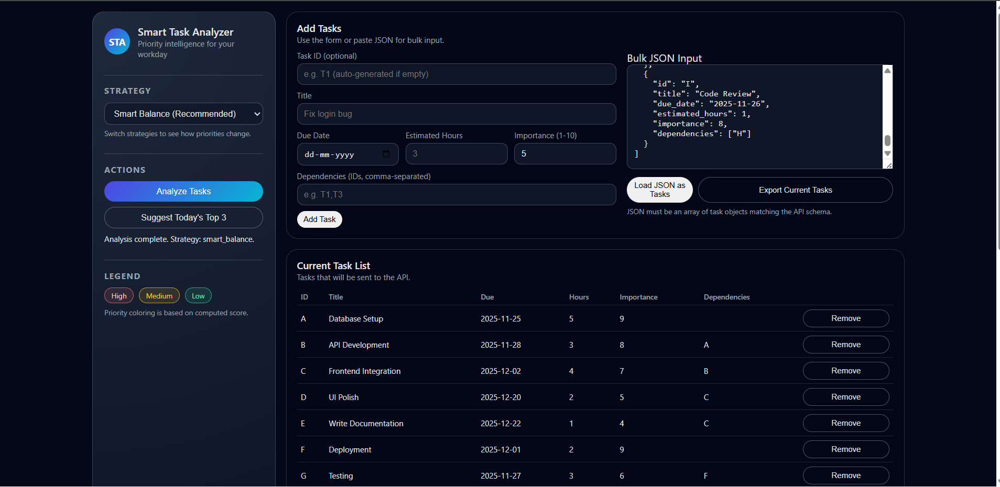
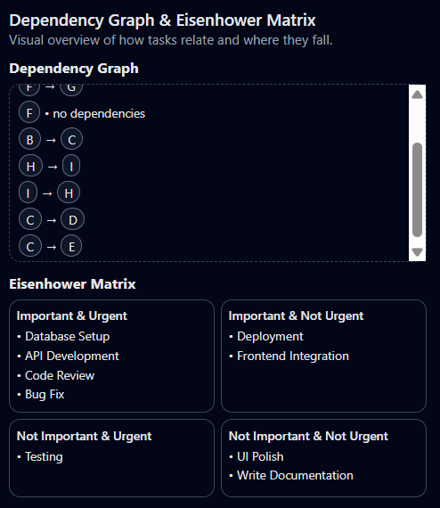
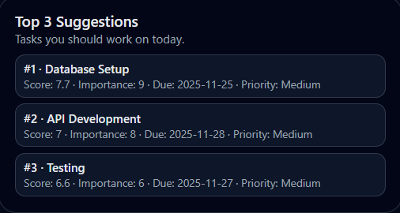

# Smart Task Analyzer

_A prioritization system powered by intelligent scoring algorithms_

**Developed by:**  
**Pranav Sampat**  
Software Development Intern Applicant – Singularium

---

## 📌 Overview

Smart Task Analyzer is a mini-application that analyzes a list of tasks and intelligently prioritizes them based on:

- urgency (due dates)
- importance
- effort required
- dependency impact
- circular dependency penalties

This project was built as part of the **Software Development Intern Technical Assessment** to demonstrate:

- algorithmic thinking
- backend development (Python + Django)
- frontend development (HTML/CSS/JS)
- clean architecture
- critical reasoning
- documentation quality

---

## ✅ Features

### 🔹 Core
- Intelligent task scoring algorithm
- Priority sorting
- API endpoints:
  - `POST /api/tasks/analyze/`
  - `GET /api/tasks/suggest/`

### 🔹 Strategies (User selectable)
- Smart Balance (default)
- Fastest Wins
- High Impact
- Deadline Driven

### 🔹 Dependency Handling
- boosts tasks that block others
- detects circular dependencies
- applies penalties to cycles

### 🔹 Frontend Dashboard
- Add tasks via form
- Bulk JSON input
- Strategy toggle
- Priority table
- Suggest Top 3 tasks
- Dependency graph visualization
- Eisenhower Matrix View

---

## 🧠 Algorithm Explanation (400 words)

The Smart Task Analyzer uses a weighted scoring model to determine which tasks provide the highest value if completed first. The algorithm balances urgency, importance, effort, and task dependencies.

### 1. Urgency
Urgency is derived from the due date. Tasks past due automatically receive the highest urgency, encouraging immediate attention. Tasks due soon receive progressively higher urgency scores, while tasks far in the future receive lower scores. Tasks without due dates are treated as low urgency.

### 2. Importance
Importance is directly provided by the user on a 1–10 scale. This reflects business or personal value. Importance enables the model to surface tasks that have high impact even if they are not the most urgent.

### 3. Effort (Quick Wins)
Effort scoring prioritizes short tasks. Tasks estimated under an hour receive the highest score, as they can be completed quickly and build momentum. Larger tasks receive lower effort scores.

### 4. Dependencies
Tasks that block others gain additional weight. The system counts how many tasks depend on a given task, increasing its priority. This encourages clearing bottlenecks in a workflow.

### 5. Circular Dependency Detection
The system performs a DFS graph traversal to detect cycles such as A → B → A. Tasks involved in circular dependencies are penalized 50% because completing them does not unblock progress.

### 6. Scoring Formula (Smart Balance)
```
score =
0.4 * urgency +
0.35 * importance +
0.15 * effort +
0.10 * dependency
```

### 7. Strategy System
Users can switch scoring logic:

- Fastest Wins prioritizes low effort
- High Impact prioritizes importance
- Deadline Driven prioritizes urgency
- Smart Balance blends all factors

This configurability demonstrates flexibility in algorithm design.

The final output is sorted descending by score, producing an ordered list of recommended tasks.

---

## 🏗️ Tech Stack

### Backend
- Python
- Django
- Django REST Framework

### Frontend
- HTML
- CSS
- JavaScript

---

## 🚀 Running the Project

### Backend

```bash
cd backend
py manage.py runserver
```

### Frontend

Open:

```
frontend/index.html
```

in a browser

---

## 🔥 API Documentation

### POST /api/tasks/analyze/

Body: JSON array of tasks

Returns:
- sorted tasks
- scores
- explanations

### GET /api/tasks/suggest/

Returns:
- top 3 tasks based on latest analysis

---

## ✅ Test Cases

See full list in README test section or run:

```bash
py manage.py test
```

✅ All tests currently pass

---

## 🧪 Unit Tests Included

- urgency scoring
- effort scoring
- smart balance ordering
- circular dependency detection

---

## 🎯 Design Decisions

- Algorithm-first development
- Clear separation of backend and frontend
- Stateless API except suggestion caching
- Human-readable explanations
- Configurable scoring strategy
- Simplicity over over-engineering

---

## ⏱️ Time Breakdown

- Backend: 2 hours
- Frontend UI: 1.5 hours
- Bonus features: 1 hour
- Testing + Debugging: 30 minutes
- Documentation: 30 minutes

Total: ~5.5 hours

---

## 🧩 Bonus Features Completed ✅

- Strategy toggle
- Dependency graph visualization
- Eisenhower Matrix View
- Circular dependency detection
- Unit tests

---

## 🚀 Future Improvements

- User authentication
- Save tasks to database
- Machine learning prioritization
- Drag and drop UI
- Task categories & tagging
- Mobile responsiveness improvements

---

## 📸 Screenshots


### 🔹 Dashboard


### 🔹 Analysis & Visualizations


### 🔹 Top 3 Suggestions



## 📎 Submission

This repository fulfills the requirements stated in the assignment document.

---

## 👤 Author

**Pranav Sampat**  
Full Stack Developer & AI Enthusiast

---

